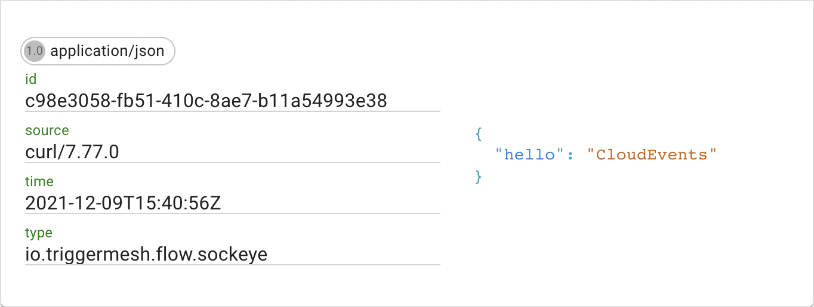

# Kong CloudEvents plugin

TriggerMesh CloudEvents plugin for Kong opens the doors for HTTP requests into the systems that are using [CloudEvent](https://cloudevents.io/) data format. The requests that are passing through the plugin are supplemented by the required headers to comply with CloudEvents [specifications](https://github.com/cloudevents/spec).

More technical details about external plugins development can be found [here](https://docs.konghq.com/gateway/2.6.x/reference/external-plugins).

## Configuration

Currently, the only parameter exposed in the plugin configuration is `eventType`. If this parameter is not set in the configuration, the default value of `io.triggermesh.flow.kong-ce-plugin` is used as the type of incoming events.


## Deployment

This plugin is written in Golang as "embedded server" in accordance with the [documentation](https://docs.konghq.com/gateway/2.6.x/reference/external-plugins).

As the plugin is still under development and it is not available in Kong [Plugin Hub](https://docs.konghq.com/hub/), deployment can be done by re-building Kong's Proxy with the plugin binary and configurations embedded in the image:

```shell
docker build -t <username>/kong . --platform linux/amd64
```

After the image is built, depending on the test environment, it can be pushed to the registry and used in the Kong Ingress deployment.

```shell
docker push <username>/kong
```

Let's assume that the Kong project is installed in the Kubernetes cluster:

```shell
kubectl -n kong set image deployment/ingress-kong proxy=<username>/kong@sha256:<hash>
```

Make sure that the new pod is up and running:

```shell
kubectl -n kong get pods
NAME                            READY   STATUS    RESTARTS   AGE
ingress-kong-59d4b75b87-xzjm9   2/2     Running   2          10m
```


## Test

Since one of the platforms that are heavily utilizing CloudEvents data format is [Knative](https://knative.dev/), we will assume that the test cluster already has Serving and Eventing components installed. It should also be noted that Knative is not set to use Kong as its Ingress Gateway, although this configuration is [possible](https://docs.konghq.com/kubernetes-ingress-controller/2.0.x/guides/using-kong-with-knative/) and should simplify services usage.

1. Deploy Sockeye service:

    ```shell
    kubectl apply -f config/sockeye.yaml
    ```

2. Open `config/kong.yaml` and update the `<namespace>` value, make sure that `url` parameter points to Sockeye service

3. Expose Kong's management API:

    ```shell
    kubectl -n kong port-forward deployment/ingress-kong 8444
    ```

4. In the second console create the service:

    ```shell
    curl -k https://localhost:8444/config -F config=@config/kong.yml
    ```

5. Open Sockeye's web interface and send POST request to Kong Ingress:

    ```shell
    KONG_ADDRESS=$(kubectl -n kong get svc kong-proxy -o jsonpath='{.status.loadBalancer.ingress[0].hostname}')
    
    curl -v $KONG_ADDRESS -d '{"hello":"CloudEvents"}' -H "Content-Type: application/json"
    ```
    *if `$KONG_ADDRESS` doesn't hold the right ingress address, retrieve the address manually.

The Sockeye service should display a new event generated by the plugin:



### Support

We would love your feedback on this plugin so don't hesitate to let us know what is wrong and how we could improve it, just file an [issue](https://github.com/triggermesh/kong-cloudevents-plugin/issues/new)

### Code of Conduct

This plugin is by no means part of [CNCF](https://www.cncf.io/) but we abide by its [code of conduct](https://github.com/cncf/foundation/blob/master/code-of-conduct.md)
